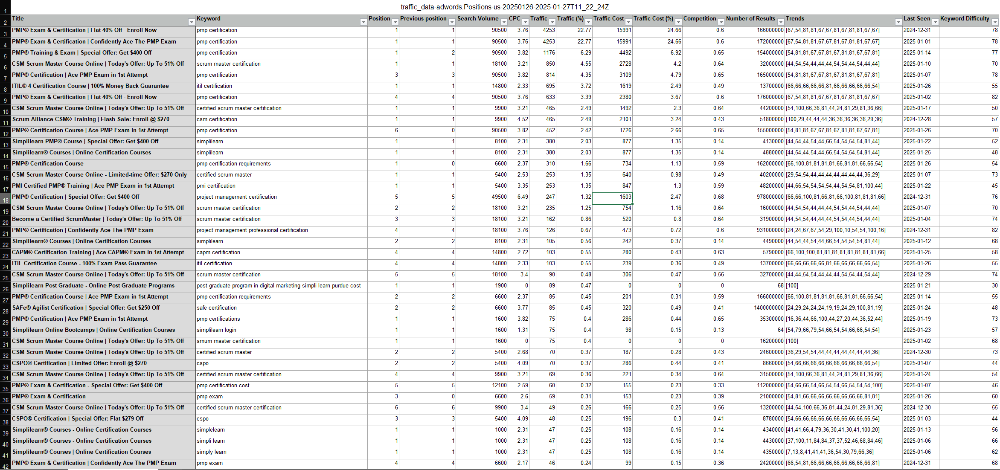
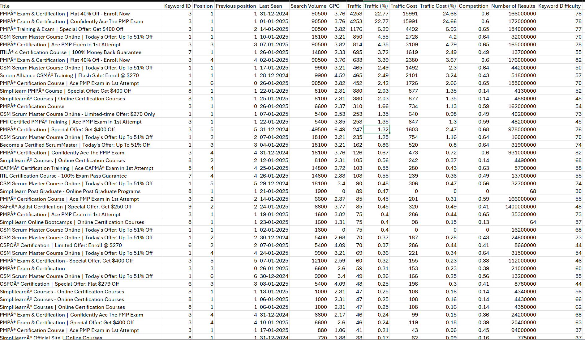
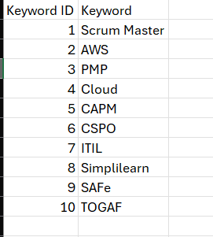
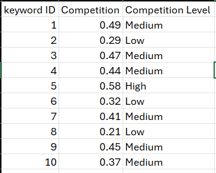
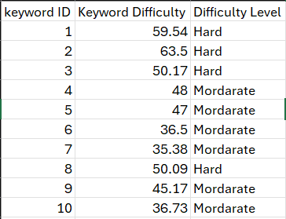
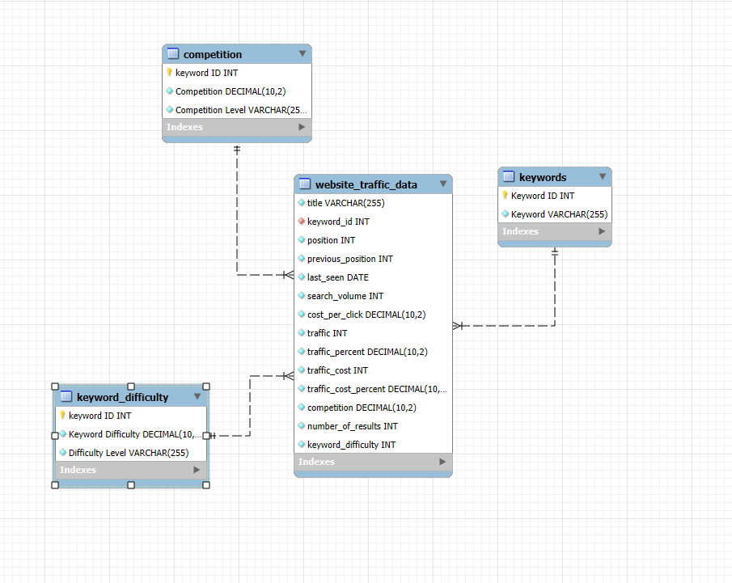
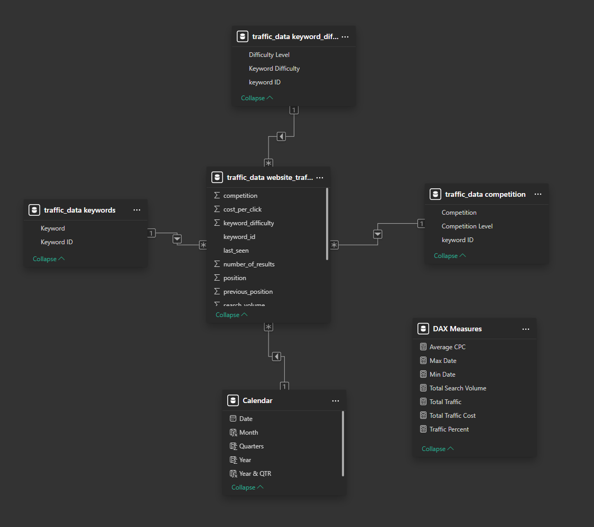

# 📊 Website Traffic & Google AdWords Analysis

**An end-to-end project using Python, Jupyter Notebook, Excel, MySQL, Pandas, NumPy, and Power BI to analyze website traffic and Google AdWords data. This project transforms raw keyword-level data into a structured relational model to uncover insights for SEO, CPC trends, and digital marketing optimization.**

---

## 📚 Table of Contents

- [🎯 Project Objective](#-project-objective)
- [🛠️ Tools Used](#️-tools-used)
- [📁 Project Files](#-project-files)
- [📁 Project Tree](#-project-tree)
- [🔄 Workflow](#-workflow)
  - [🐍 1. Python (Data Cleaning & Fact + Keyword Table Creation)](#-1-python-data-cleaning--fact--keyword-table-creation)
  - [📊 2. Excel (Other Dimension Table Generation)](#-2-excel-other-dimension-table-generation)
  - [🛢️ 3. MySQL (Fact Table Structure First, Then Imports & Keys)](#-3-mysql-fact-table-structure-first-then-imports--keys)
  - [📈 4. Power BI (Visualization, Modeling & DAX)](#-4-power-bi-visualization-modeling--dax)
- [🧩 Data Model Overview](#-data-model-overview)
- [✅ Key Features](#-key-features)
- [📜 License](#-license)
- [🤝 Contributing](#-contributing)
- [👤 Author](#-author)

---

## 🎯 Project Objective

To convert raw AdWords and website traffic data into a clean, structured dataset that enables analysis of:
- Keyword ranking trends and performance
- CPC, competition, and keyword difficulty
- Traffic share and keyword cost-effectiveness
- Budget optimization for paid ads and SEO strategy

## 🛠️ Tools Used

| Tool/Library        | Purpose                                                                 |
|---------------------|-------------------------------------------------------------------------|
| **Python**           | Assign `keyword_id`, create fact and keyword dimension tables           |
| **Jupyter Notebook** | Interactive Python code and data processing                             |
| **Pandas**           | Data manipulation and cleaning                                          |
| **NumPy**            | Numerical transformation support                                        |
| **Excel**            | Create `competition` and `keyword_difficulty` dimension tables          |
| **MySQL**            | Define fact table structure first, then import data & enforce relations |
| **Power BI**         | Build dashboards, model schema, and use DAX for reporting               |

---

## 📁 Project Files

### 📄 Data Files
- **Raw Source**
  - `data/raw/traffic_data_RAW.xls` – Original keyword and traffic data export  
- **Fact Table**
  - `data/final/website_traffic_data.csv` – Keyword-level traffic metrics (Python-generated)  
- **Dimension Tables**
  - `data/final/keyword.csv` – Keyword ID and text (Python-generated)  
  - `data/final/competition.csv` – Competition scores (Excel-generated)  
  - `data/final/keyword_difficulty.csv` – Difficulty ratings (Excel-generated)  

### ⚙️ Scripts & Notebooks
- `notebooks/assaign_keyword_ID.ipynb` – Python notebook for:
  - Assigning `keyword_id`s  
  - Generating `data/final/website_traffic_data.csv` and `data/final/keyword.csv`  
- `sql/traffic_data_script.sql` – SQL script to:
  - Apply primary/foreign keys  
  - Finalize schema relationships after importing all data

---

## 📂 Project Tree

```
website_traffic_google_ADword_analysis/
├─ configs/
│  └─ db_config.yaml
├─ data/
│  ├─ final/
│  │  ├─ .gitkeep
│  │  ├─ competition.csv
│  │  ├─ keyword_difficulty.csv
│  │  ├─ keyword.csv
│  │  └─ website_traffic_data.csv
│  ├─ interim/
│  │  └─ .gitkeep
│  └─ raw/
│     ├─ .gitkeep
│     └─ traffic_data_RAW.xls
├─ images/
├─ notebooks/
│  ├─ .gitkeep
│  └─ assaign_keyword_ID.ipynb
├─ reports/
│  ├─ dashboards/
│  │  ├─ .gitkeep
│  │  └─ website traffic data.pbix
│  ├─ figures/
│  │  ├─ .gitkeep
│  │  ├─ competition.png
│  │  ├─ excel_raw_data.png
│  │  ├─ keyword_difficulty.png
│  │  ├─ keyword.png
│  │  ├─ mysql_table_relation.png
│  │  ├─ power_bi_modeling.png
│  │  ├─ traffic_data_dashboard.png
│  │  └─ website_traffic_data.png
│  └─ summary_reports/
│     └─ .gitkeep
├─ scripts/
│  └─ .gitkeep
├─ sql/
│  ├─ .gitkeep
│  └─ traffic_data_script.sql
├─ .gitignore
├─ LICENCE
├─ README.md
└─ requirements.txt

```
---
## 🔄 Workflow

### 🐍 1. Python (Data Cleaning & Fact + Keyword Table Creation)
- Load `traffic_data_RAW.xls`

- Assign unique `keyword_id`s using Python

```python
 def keyword_id(text):
    if "scrum" in text or "csm" in text or "smum" in text or "srum" in text:
        return 1
    elif "amazon" in text or "aws" in text or "devops" in text:
        return 2
    elif (
        "pmp" in text
        or "project management" in text
        or "pmi" in text
        or "proyectos" in text
        or "it project" in text
    ):
        return 3
    elif "cloud" in text:
        return 4
    elif "capm" in text:
        return 5
    elif "cspo" in text:
        return 6
    elif "itil" in text or "itl" in text:
        return 7
    elif (
        "simpl" in text
        or "simli" in text
        or "simpi" in text
        or "smpli" in text
        or "simi" in text
        or "sipli" in text
    ):
        return 8
    elif "safe" in text or "scale" in text:
        return 9
    elif "togaf" in text or "udacity" in text or "it architect" in text:
        return 10


df["Keyword ID"] = df["Keyword"].apply(keyword_id)
df.head(10)
```

- Extract and clean `keyword` names alongside IDs

```python
def keyword(value):
    if 1 == value:
        return 'Scrum Master'
    elif 2 == value:
        return 'AWS'
    elif 3 == value:
        return 'PMP'
    elif 4 == value:
        return 'Cloud'
    elif 5 == value:
        return 'CAPM'
    elif 6 == value:
        return 'CSPO'
    elif 7 == value:
        return 'ITIL'
    elif 8 == value:
        return 'Simplilearn'
    elif 9 == value:
        return 'SAFe'
    elif 10 == value:
        return 'TOGAF'
    else:
        return 'No Value'
    
website_traffic_data['Keyword'] = website_traffic_data['Keyword ID'].apply(keyword)
website_traffic_data.head(10)
```

- Clean and Format data using Pandas and NumPy
- Export:
  - `data/final/website_traffic_data.csv` (fact table)
  
  - `data/final/keyword.csv` (dimension table)         
  

### 📊 2. Excel (Other Dimension Table Generation)
- Use Excel formulas (VLOOKUP, XLOOKUP, SUMIF) to create:
  - `data/final/competition.csv`   
  
  - `data/final/keyword_difficulty.csv`   
  

### 🛢️ 3. MySQL (Fact Table Structure First, Then Imports & Keys)
- **Create `data/final/website_traffic_data` table structure first** in MySQL to avoid data mismatch

```mysql
CREATE TABLE website_traffic_data (
    title VARCHAR(255) NOT NULL,
    keyword_id INT NOT NULL,
    position INT NOT NULL,
    previous_position INT NOT NULL,
    last_seen DATE NOT NULL,
    search_volume INT NOT NULL,
    cost_per_click DECIMAL(10 , 2 ) NOT NULL,
    traffic INT NOT NULL,
    traffic_percent DECIMAL(10 , 2 ) NOT NULL,
    traffic_cost INT NOT NULL,
    traffic_cost_percent DECIMAL(10 , 2 ) NOT NULL,
    competition DECIMAL(10 , 2 ) NOT NULL,
    number_of_results INT NOT NULL,
    keyword_difficulty INT NOT NULL
);
```

- Import all `.csv` files:  
  - `data/final/website_traffic_data.csv`  
  - `data/final/keyword.csv`  
  - `data/final/competition.csv`  
  - `data/final/keyword_difficulty.csv`
- Run `sql/traffic_data_script.sql` to:
  - Apply primary keys to dimension tables

  ```mysql
  ALTER TABLE competition ADD CONSTRAINT pk_competition PRIMARY KEY (`keyword ID`);
  ALTER TABLE keyword_difficulty ADD CONSTRAINT pk_keyword_difficulty PRIMARY KEY (`keyword ID`);
  ALTER TABLE keywords ADD CONSTRAINT pk_keywords PRIMARY KEY (`keyword ID`);
  ```

  - Add foreign key constraints to relate tables

  ```mysql
  ALTER TABLE website_traffic_data ADD CONSTRAINT fk_competition FOREIGN KEY (keyword_id) REFERENCES competition(`keyword ID`);
  ALTER TABLE website_traffic_data ADD CONSTRAINT fk_keyword_difficulty FOREIGN KEY (keyword_id) REFERENCES keyword_difficulty(`keyword ID`);
  ALTER TABLE website_traffic_data ADD CONSTRAINT fk_keywords FOREIGN KEY (keyword_id) REFERENCES keywords(`keyword ID`);
  ```
  
- ✅ **Use MySQL Workbench ER Diagram** to visually validate relationships between fact and dimension tables


### 📈 4. Power BI (Visualization, Modeling & DAX)


#### 📐 Data Modeling in Power BI
- Imported all tables directly from MySQL
- Verified relationships using Power BI’s model view
- Ensured correct cardinality and cross-filtering direction
- Modeled using a clean **star schema** layout for performance and clarity


#### 🧮 DAX Measures and Logic
- Created calculated columns and measures such as:
  - `Average CPC = AVERAGE('traffic_data website_traffic_data'[cost_per_click])`
  - `Total Search Volume = SUM('traffic_data website_traffic_data'[search_volume])`
  - `SUM('traffic_data website_traffic_data'[traffic])`
  - `Total Traffic Cost = SUM('traffic_data website_traffic_data'[traffic_cost])`
  - `Traffic Percent = AVERAGE('traffic_data website_traffic_data'[traffic_percent])`
  - `Calendar = CALENDAR([Min Date],[Max Date])`
  - `Max Date = MAX('traffic_data website_traffic_data'[last_seen])`
  - `Min Date = MIN('traffic_data website_traffic_data'[last_seen])`
- Built dashboards using visuals, slicers, and cards to showcase performance trends and keyword insights

## 🧩 Data Model Overview

| Table Name              | Type         | Description                                | Key Field     | Created Using |
|-------------------------|--------------|--------------------------------------------|---------------|----------------|
| `website_traffic_data`  | Fact Table   | Keyword-level AdWords traffic metrics      | `keyword_id`  | Python          |
| `keyword`               | Dimension    | Keyword ID and name mapping                | `keyword_id`  | Python          |
| `competition`           | Dimension    | Keyword competition scores                 | `keyword_id`  | Excel           |
| `keyword_difficulty`    | Dimension    | Keyword difficulty ratings                 | `keyword_id`  | Excel           |

---

## ✅ Key Features
- Assign and manage keyword IDs using Python  
- Build normalized relational structure in MySQL  
- Use Excel for additional dimension data  
- Apply schema constraints and validate relationships with ER diagrams  
- Model and visualize insights in Power BI with custom DAX measures

---

## 🚀 How to Use
1. Run Python notebook to generate:
   - `data/final/website_traffic_data.csv`  
   - `data/final/keyword.csv`  
2. Create `data/final/competition.csv` and `data/final/keyword_difficulty.csv` in Excel  
3. In MySQL:
   - Create structure for `website_traffic_data` first  
   - Import all `.csv` files  
   - Run `sql/traffic_data_script.sql` to define schema and constraints  
   - Validate schema with ERD view  
4. Connect Power BI to MySQL  
5. Model the data and use DAX to create KPIs and dashboards

---

## 📜 License

This project is licensed under the MIT License.

---

## 🤝 Contributing

Contributions are welcome! Please fork the repository and submit a pull request.

---

## 👤 Author

Hi, I'm Hemant, a data enthusiast passionate about turning raw data into meaningful business insights.

📫 **Let’s connect:**
- LinkedIn : [LinkedIn Profile](https://www.linkedin.com/in/hemant1491/)  
- Email : hemant4dsci@gmail.com

---
