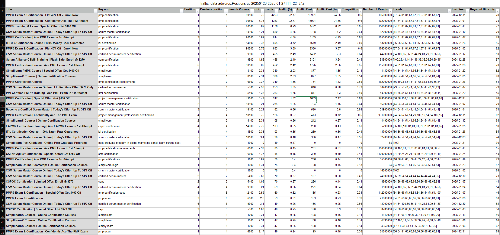
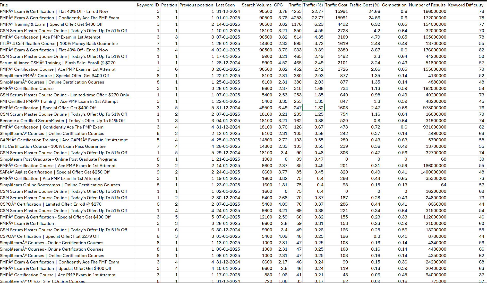
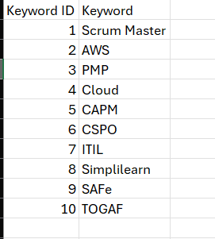

# 📊 Website Traffic & Google AdWords Analysis

**An end-to-end project using Python, Jupyter Notebook, Excel, MySQL, Pandas, NumPy, and Power BI to analyze website traffic and Google AdWords data. This project transforms raw keyword-level data into a structured relational model to uncover insights for SEO, CPC trends, and digital marketing optimization.**

---

## 📚 Table of Contents

- [🎯 Project Objective](#-project-objective)
- [🛠️ Tools Used](#️-tools-used)
- [📁 Project Files](#-project-files)
- [🔄 Workflow](#-workflow)
  - [🐍 1. Python (Data Cleaning & Fact + Keyword Table Creation)](#-1-python-data-cleaning--fact--keyword-table-creation)
  - [📊 2. Excel (Other Dimension Table Generation)](#-2-excel-other-dimension-table-generation)
  - [🛢️ 3. MySQL (Fact Table Structure First, Then Imports & Keys)](#-3-mysql-fact-table-structure-first-then-imports--keys)
  - [📈 4. Power BI (Visualization, Modeling & DAX)](#-4-power-bi-visualization-modeling--dax)
- [🧩 Data Model Overview](#-data-model-overview)
- [✅ Key Features](#-key-features)
- [🚀 How to Use](#-how-to-use)
- [👤 About Me](#-about-me)

---

## 🎯 Project Objective

To convert raw AdWords and website traffic data into a clean, structured dataset that enables analysis of:
- Keyword ranking trends and performance
- CPC, competition, and keyword difficulty
- Traffic share and keyword cost-effectiveness
- Budget optimization for paid ads and SEO strategy

## 🛠️ Tools Used

| Tool/Library        | Purpose                                                                 |
|---------------------|-------------------------------------------------------------------------|
| **Python**           | Assign `keyword_id`, create fact and keyword dimension tables           |
| **Jupyter Notebook** | Interactive Python code and data processing                             |
| **Pandas**           | Data manipulation and cleaning                                          |
| **NumPy**            | Numerical transformation support                                        |
| **Excel**            | Create `competition` and `keyword_difficulty` dimension tables          |
| **MySQL**            | Define fact table structure first, then import data & enforce relations |
| **Power BI**         | Build dashboards, model schema, and use DAX for reporting               |

## 📁 Project Files

### 📄 Data Files
- **Raw Source**
  - `traffic_data_RAW.xls` – Original keyword and traffic data export  
- **Fact Table**
  - `website_traffic_data.csv` – Keyword-level traffic metrics (Python-generated)  
- **Dimension Tables**
  - `keyword.csv` – Keyword ID and text (Python-generated)  
  - `competition.csv` – Competition scores (Excel-generated)  
  - `keyword_difficulty.csv` – Difficulty ratings (Excel-generated)  

### ⚙️ Scripts & Notebooks
- `assaign_keyword_ID.ipynb` – Python notebook for:
  - Assigning `keyword_id`s  
  - Generating `website_traffic_data.csv` and `keyword.csv`  
- `traffic_data_script.sql` – SQL script to:
  - Apply primary/foreign keys  
  - Finalize schema relationships after importing all data  

## 🔄 Workflow

### 🐍 1. Python (Data Cleaning & Fact + Keyword Table Creation)
- Load `traffic_data_RAW.xls`

- Assign unique `keyword_id`s using Python
```python
  def keyword_id(text):
    if 'scrum' in text or 'csm' in text or 'smum' in text or 'srum' in text:
        return 1
    elif 'amazon' in text or 'aws' in text or 'devops' in text:
        return 2
    elif 'pmp' in text or 'project management' in text or 'pmi' in text or 'proyectos' in text or 'it project' in text:
        return 3
    elif 'cloud' in text:
        return 4
    elif 'capm' in text:
        return 5
    elif 'cspo' in text:
        return 6
    elif 'itil' in text or 'itl' in text:
        return 7
    elif 'simpl' in text or 'simli' in text or 'simpi' in text or 'smpli' in text or 'simi' in text or 'sipli' in text:
        return 8
    elif 'safe' in text or 'scale' in text:
        return 9
    elif 'togaf' in text or 'udacity' in text or 'it architect' in text:
        return 10

df['Keyword ID'] = df['Keyword'].apply(keyword_id)
df.head(10)
```
- Extract and clean `keyword` names alongside IDs
```python
def keyword(value):
    if 1 == value:
        return 'Scrum Master'
    elif 2 == value:
        return 'AWS'
    elif 3 == value:
        return 'PMP'
    elif 4 == value:
        return 'Cloud'
    elif 5 == value:
        return 'CAPM'
    elif 6 == value:
        return 'CSPO'
    elif 7 == value:
        return 'ITIL'
    elif 8 == value:
        return 'Simplilearn'
    elif 9 == value:
        return 'SAFe'
    elif 10 == value:
        return 'TOGAF'
    else:
        return 'No Value'
    
website_traffic_data['Keyword'] = website_traffic_data['Keyword ID'].apply(keyword)
website_traffic_data.head(10)
```
- Clean and Format data using Pandas and NumPy
- Export:
  - `website_traffic_data.csv` (fact table)
  
  - `keyword.csv` (dimension table)         
  

### 📊 2. Excel (Other Dimension Table Generation)
- Use Excel formulas (VLOOKUP, XLOOKUP, SUMIF) to create:
  - `competition.csv`  
  - `keyword_difficulty.csv`

### 🛢️ 3. MySQL (Fact Table Structure First, Then Imports & Keys)
- **Create `website_traffic_data` table structure first** in MySQL to avoid data mismatch
- Import all `.csv` files:  
  - `website_traffic_data.csv`  
  - `keyword.csv`  
  - `competition.csv`  
  - `keyword_difficulty.csv`
- Run `traffic_data_script.sql` to:
  - Apply primary keys to dimension tables  
  - Add foreign key constraints to relate tables
- ✅ **Use MySQL Workbench ER Diagram** to visually validate relationships between fact and dimension tables

### 📈 4. Power BI (Visualization, Modeling & DAX)

#### 📐 Data Modeling in Power BI
- Imported all tables directly from MySQL
- Verified relationships using Power BI’s model view
- Ensured correct cardinality and cross-filtering direction
- Modeled using a clean **star schema** layout for performance and clarity

#### 🧮 DAX Measures and Logic
- Created calculated columns and measures such as:
  - `Total Traffic = SUM(website_traffic_data[Traffic])`
  - `Avg CPC = AVERAGE(website_traffic_data[CPC])`
  - `CTR = DIVIDE([Traffic], [Total Impressions])`
  - `High Potential Score = IF([Competition] < 0.5 && [Keyword Difficulty] < 40, "Yes", "No")`
- Built dashboards using visuals, slicers, and cards to showcase performance trends and keyword insights

## 🧩 Data Model Overview

| Table Name              | Type         | Description                                | Key Field     | Created Using |
|-------------------------|--------------|--------------------------------------------|---------------|----------------|
| `website_traffic_data`  | Fact Table   | Keyword-level AdWords traffic metrics      | `keyword_id`  | Python          |
| `keyword`               | Dimension    | Keyword ID and name mapping                | `keyword_id`  | Python          |
| `competition`           | Dimension    | Keyword competition scores                 | `keyword_id`  | Excel           |
| `keyword_difficulty`    | Dimension    | Keyword difficulty ratings                 | `keyword_id`  | Excel           |

## ✅ Key Features
- Assign and manage keyword IDs using Python  
- Build normalized relational structure in MySQL  
- Use Excel for additional dimension data  
- Apply schema constraints and validate relationships with ER diagrams  
- Model and visualize insights in Power BI with custom DAX measures

## 🚀 How to Use
1. Run Python notebook to generate:
   - `website_traffic_data.csv`  
   - `keyword.csv`  
2. Create `competition.csv` and `keyword_difficulty.csv` in Excel  
3. In MySQL:
   - Create structure for `website_traffic_data` first  
   - Import all `.csv` files  
   - Run `traffic_data_script.sql` to define schema and constraints  
   - Validate schema with ERD view  
4. Connect Power BI to MySQL  
5. Model the data and use DAX to create KPIs and dashboards

---

## 👤 About Me

Hi, I'm Hemant, a data enthusiast passionate about turning raw data into meaningful business insights.

📫 **Let’s connect:**  
- GitHub : [GitHub Profile](https://github.com/hemant1491)
- LinkedIn : [LinkedIn Profile](https://www.linkedin.com/in/hemant1491/)  
- Email : hemant0452@outlook.com

---


---
